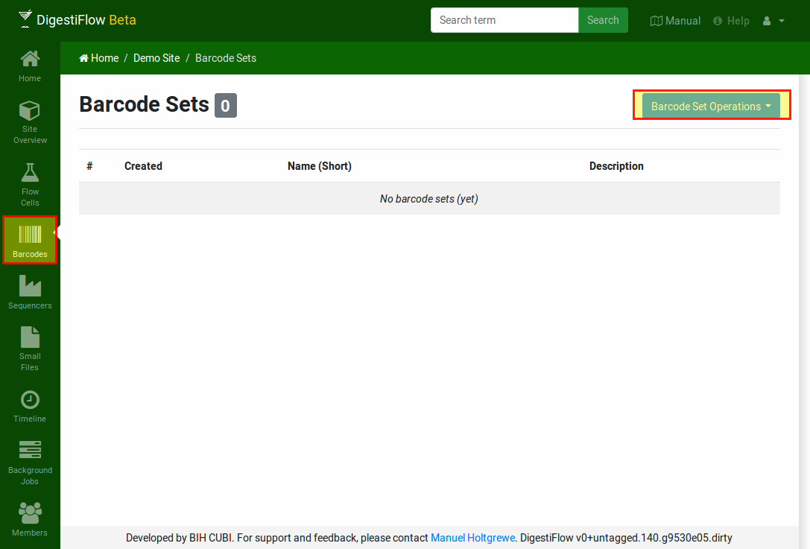
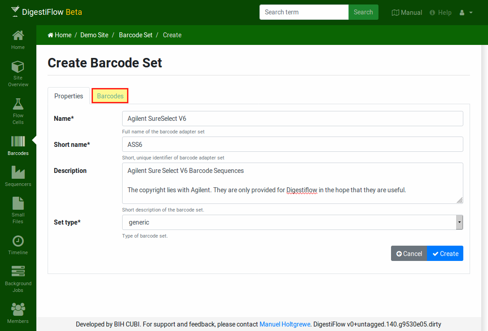
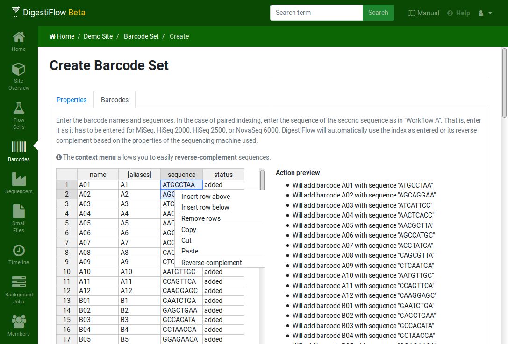
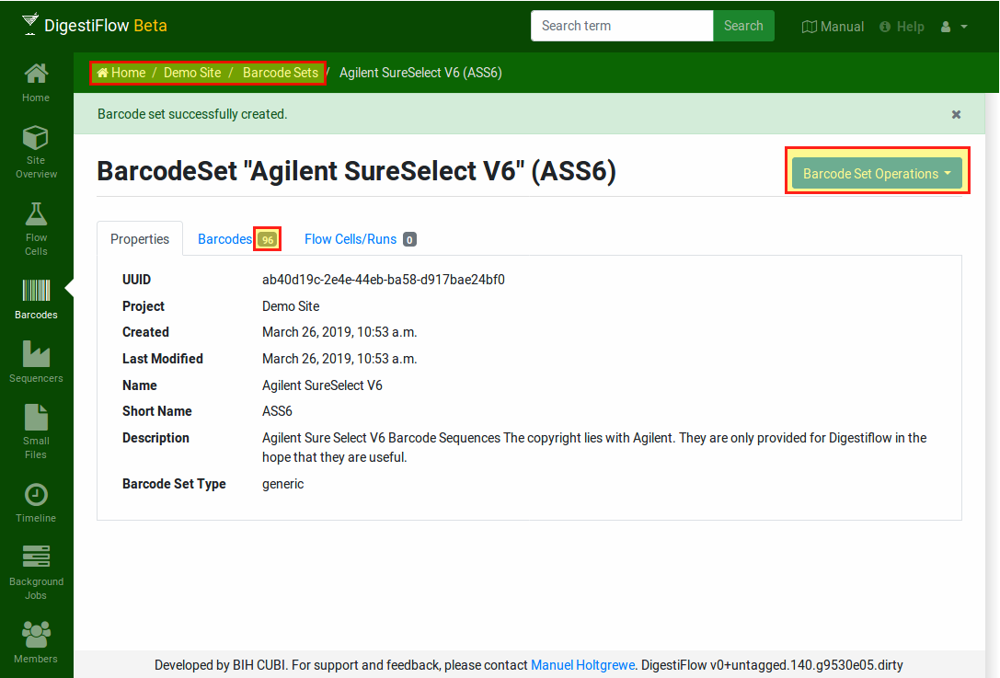

.. _first_steps_barcodes:

============================
Tutorial: Configure Barcodes
============================

Clicking the "Barcodes" entry in the green menu on the left-hand brings you to the barcode sets overview of your site.
This allows for managing barcode (index adapter sequence) sets in your site that you can reuse.
You can then refer to these barcodes by their name (or number) and thus simplify the error-prone copy-and-paste step of copying adapter sequences around.

    An empty list of barcode sets.

Managing barcodes is similar to managing sequencers.
First, click the blue "Barcodes Operation" on the top right and then "Create".

Fill in the basic properties of the barcode set in the "Properties" page.

    Editor for the barcode set properties.

Then, select the "Barcodes" tab.
In case of display errors of the table, just click in the first cell of the leftmost column.
You can now enter (or better: copy and paste) your barcodes from a spreadsheet or your kit vendor's manual.
You can find an example for the Agilent SureSelect V6 adapters in the file ``Barcodes_Agilent_SureSelect_V6.xlsx`` in `here <https://github.com/bihealth/digestiflow-server/tree/master/tutorial>`_.

    The editor tab for editing the barcodes.

Simply copy and paste the data from the spreadsheet file into the barcodes table.
Note that a context menu is available, e.g., for quickly reverse-complementing bases.

The columns of the are as follows:

name
    The primary name of the adapter, e.g., ``A001``.
aliases
    An optional, comma-separated list of adapters names, e.g., ``1,01,001``.
sequence
    The adapter sequence.
    Note that you always enter the **forward** adapter sequence in Digestiflow.
    In the case of dual indexing, Digestiflow Demux will automatically reverse-complement the adapter sequence if necessary for the dual indexing workflow of your sequncing device.
status
    This field is updated by the barcode editor and indicates whether the current row is added or changed.

After completely filling out the barcode set table, continue by clicking the blue "Create" on the top right of the form.
The detail screen of a barcode set offers a blue "Barcode Set Operations" button which gives access to creating new barcode sets, updating or deleting the current one, or creating a JSON data export.

    The barcode set detail view shows the basic properties and has a tab for displaying the barcode set's barcodes.

Again, the breadcrumb on the top allows you to quickly navigate to the barcode set list or the project overview.
Both will show the barcode set that you just created.

Before proceeding to the creation of flow cells, add a new barcode set for test data.
You can find the barcode set properties and sequences in the file ``Barcodes_Test.xlsx`` `here <https://github.com/bihealth/digestiflow-server/tree/master/tutorial>`_.
