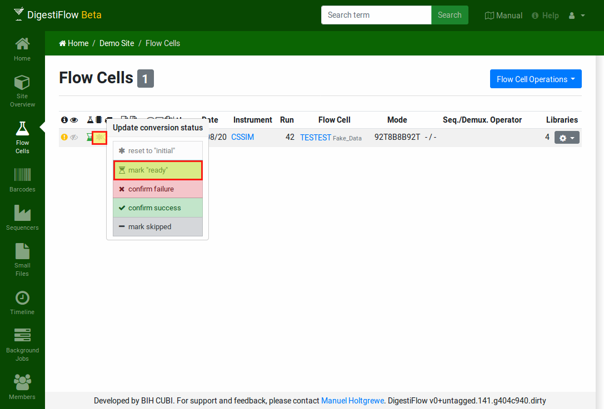

.. _first_steps_flowcell_demux:

===============================
Tutorial: Demultiplex Flow Cell
===============================

The final step is to perform the actual demultiplexing of the flow cell's base call data into FASTQ sequences.
The first (easy) step is to install the ``digestiflow-demux`` program using Conda.
The second (also easy) step is to perform the ``digestiflow-demux`` call that will handle everything else.
The third step... there is no step three!

-----------------------------
Installing Digestiflow Demux
-----------------------------

After activating your Conda installation (if you have not done so already), you can simply install the ``digestiflow-demux`` conda package into its own environment.

.. code-block:: shell

    ~ # source path/to/miniconda3/bin
    (base) ~ # conda create -n digestiflow-demux digestiflow-demux
    [...]
    (base) ~ # conda activate digestiflow-demux
    (digestiflow-demux) ~ # digestiflow-demux --help
    [...]

-----------------------------
Performing the Demultiplexing
-----------------------------

After having properly configured the ``.digestiflowrc.toml`` file earlier in the tutorial, Digestiflow Demux is already properly configured.
All you have to do is to pass the proper project ID and the path to the flow cell directories to look at.
Digestiflow Demux will then perform the demultiplexing, quality control, and post the results to the flow cell's messages in Digestiflow Server.
Make sure that you have activated your conda installation and the ``digestiflow-demux`` environment as described above.

There is one more step before calling ``digestiflow-demux`` though.
You have to set the "demultiplexing" status to "ready" in Digestiflow Server.
Navigate to the flow cell list.
Then, click on the state icon in the "demultiplexing" column and select "ready".
The row will change to display a light blue sand clock icon to indicate that the demultiplexing process is ready to start.

    Mark the flow cell as ready for demultiplexing by first clicking on the icon in the demultiplexing state column.
    Then select the "ready" entry in the popup.

Now you can start the demultiplexing using the ``digestiflow-demux`` program.
Digestiflow Demux will only consider flow cells that are marked as "ready".
If you want to restart demultiplexing after it fails or if you want to repeat it then you have to set the state to "ready" again as well.

.. note::

    Although you would **usually not use it**, you have to use the ``--with-failed-reads`` argument for the synthetic example data set.
    The reason is that the adapter for the fourth sample is ``TTTTTTTT`` and this is filtered by ``bcl2fastq`` as a common artifact.

.. code-block:: shell

    ~ # source path/to/miniconda3/bin
    (base) # conda activate digestiflow-demux
    (digestiflow-demux) ~ # digestiflow-demux --help
    [...]
    (digestiflow-demux) ~ # mkdir -p demux-out
    (digestiflow-demux) ~ # digestiflow-demux \
        --with-failed-reads \
        --project-uuid xxxxxxxx-xxxx-xxxx-xxxx-xxxxxxxxxxx \
        demux-output/130820_CSSIM_0123_B_TESTEST_Test_Label
        130820_CSSIM_0123_B_TESTEST_Test_Label

After demultiplexing was started, reloading the flow cell table will show a black sand clock for the demultiplexing of your flow cell.
This indicates that the demultiplexing is running.
Once complete a green sand clock will be displayed and on error a red one will be shown.
You can confirm success or failure by clicking the flow cell and selecting the appropriate option.
Note that in case of problems, the demultiplexing status will be updapted to "failed" by Digestiflow Demux.
You will have to manually set it back to "ready" such that the flow cell is considered again for demultiplexing.

    The flow cell status after demultiplexing was complete.

.. note::

    The authors consider it best practice to use this feature after inspecting quality control results and/or logs to validate that the demultiplexing succeeded.
    In case of confirming failure and "giving up", the authors recommend to leave a note in the flow cell's messages section explaining the failure and abandoning demultiplexing.

The demultiplexing and quality control should succeed.
You should see according log messages and quality control results in the messages section of your flow cell.
