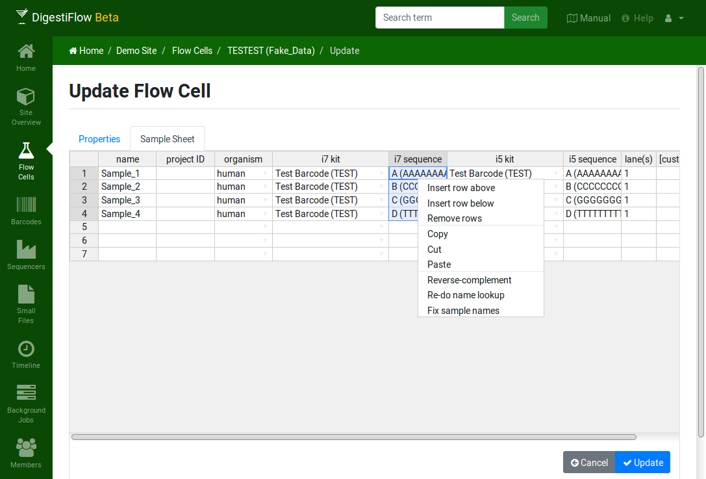

.. _first_steps_flowcell_fill:

============================
Tutorial: Fill Out Flow Cell
============================

It is very common that the wet-lab curates spreadsheets for the libraries, annotating the sample/library names with the used barcode and measurements results such as concentration or quality control results.
It is thus desirable to re-use and copy-and-paste this information instead of re-entering it.
We will thus assume this use case for this tutorial.

----------------------
The Sample Spreadsheet
----------------------

Download the file ``130820_CSSIM_0123_B_TESTEST_Test_Label.xlsx`` from `here <https://github.com/bihealth/digestiflow-web/tree/master/tutorial>`_ and open it.
This file contains an excerpt of the information that the authors would expect to get from the wet lab.
Open the file with your favourite spreadsheet program and have a quick look.
The file is simple enough, containing the sample name, the i7 and i5 index names as well as the lane numbers on which the sample were loaded.

-------------------------
Transfer into Digestiflow
-------------------------

You can access the flow cell editor using the blue button on the flow cell detail view or by clicking the little gray icon next to the entry for the test flow cell and then clicking "Update".
Select the "Libraries" tab to display the flow cell library editor.
You will now copy over the data column-by-column from the sample sheet.

1. Select the cells with the library names in your spreadsheet program.
   Copy them into your clipboard (e.g., using Ctrl+C).
   Insert them into the libraries table in Digestiflow by selecting the first cell in the "sample names" column and then either pressing Ctrl+V or right-clicking on the cell and clicking "paste".
2. All data is of human origin.
   Select the top-most cell of the "organism" cell and select "human" after clicking the little triangle on the right side of the cell.
   Then make sure the cell and select the cell content using Ctrl+C or right-click and selecting copy.
   Select the cells in the same column up to the row with the last sample name.
   Then paste the value to all cells using Ctrl+V or right-clicking and selecting "paste".
3. Next, select the correct i7 barcode index **types** using the little triangle as in step 2.
   Then use the same approach to copy and paste this values to all cells in this column.
4. Next, we can copy and paste over the i7 barcode **names** names into the next column using the same approachas in step 1.
5. Repeat the step for setting the i5 barcode index type and names as you did for the i7 barcodes in step 3 and 4.
6. Finally, copy over the lane numbers from the spreadsheet app as you did with the library names.

    The filled out sample sheet with the generated example data.

Note that there are various actions available (such as deleting a row of the table) in the context menu that opens when right-clicking on a cell.
Don't forget to save your changes using the "Save" button once you are happy with the libraries table.
