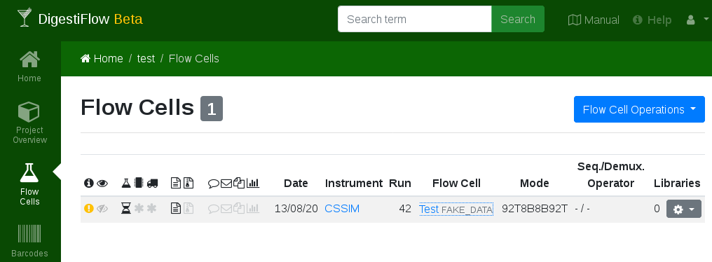
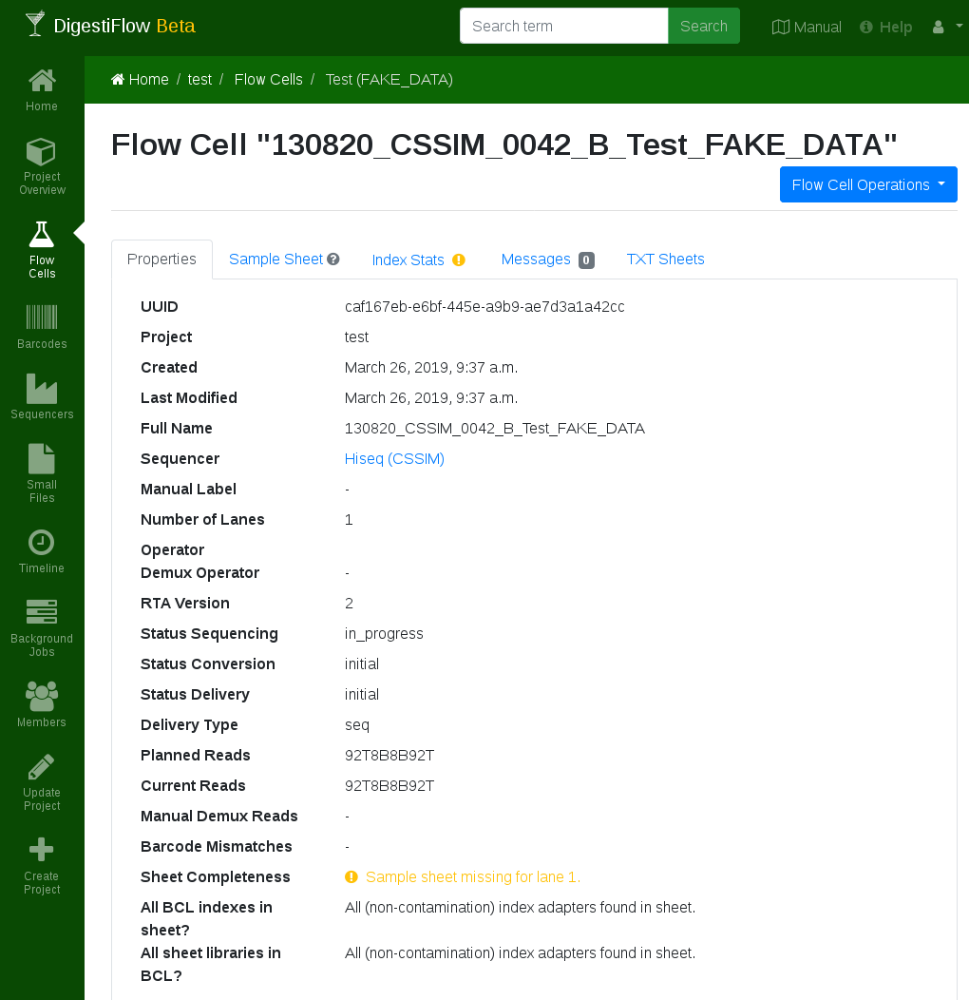

.. _first_steps_flowcell_import:

====================
Tutorial: Flow Cells
====================

Click on the "Flow Cells" icon in the left action menu.
Here, you get a list of the flow cells in your site.
We will first create a new flow cell manually and then use some auto-generated data for showing you the automated import with Digestiflow CLI.

-------------------------
Manual Flow Cell Creation
-------------------------

Click the blue "Flow Cell Operations" button on the top left to create a new flow cell.
You see the flow cell editor form with tabs "Properties" and "Sample Sheets".

The "Properties" tab allows you to edit the basic properties.

Name
    The name of the flow cell folder as you would enter it when starting your sequencing process, e.g., ``160303_ST-K12345_0815_A_BCDEFGHIXX_LABEL``.
    This would describe a flow cell with Illumina ID ``BCDEFGHIXX`` run on March 3, 2016, on the machine with the vendor ID ``ST-K12345`` in its 815th run in slot ``A`` having a manual label of ``LABEL``.
    Note that for NextSeq, the slot ``A`` is often unseparated with the flow cell ID.
Manual Label
    An optional manual override of the label to use in Digestiflow Web.
Description
    An optional short description of the flow cell, e.g., that it is a repetition of earlier drop-outs.
Num Lanes
    Number of lanes on flow cell.
Sequencer Operator
    Name of the sequencing operator.
Demultiplexing Operator
    Name of person responsible for demultiplexing.
Status Sequencing
    Current state of sequencing step.
Status Conversion
    Current state of demultiplexing or archive creation step.
Status Delivery
    Current state of data delivery.
Delivery Type
    The delivery types, either sequencers, archive of base calls, or both.
Barcode Mismatches
    Optional, specification of the number of mismatches.
Planned Reads
    Planned read specification when programming the sequencer, Picard-style.
    A sequence of number-letter pairs, e.g., ``150T8B8B150T`` (for 150T, 8B, 8B, 150T representing 150 template bases, 8 barcode bases, 8 further barcode bases, 150 further template bases).
    The allowed letters are ``T`` for template, ``B`` for barcode, ``M`` for molecular barcode, and ``S`` for skipping bases.
Current Reads
    Currently sequenced cycle sequence.
Demux Reads
    An optional override to use for demultiplexing.
    For example, if planned reads is ``100T``, specifying ``10M90T`` specifies that the first ten bases are a molecular barcode ligated to 90 bases of template.
    As another example, if planned reads is ``100T10B10B`` then ``100T10B10M`` specifies 100 template reads, tenbarcode reads (used for demultiplexing), followed by ten further molecular barcode bases (that will be handled just like another read).

The tab "Sample Sheet" allows for editing the sample sheet.
The columns are:

name
    The name of the library.
project ID
    An optional project identifier.
organism
    The organism of the sample.
i7 kit
    The kit used for the i7 barcode.
i7 sequence
    The actual sequence.
    An entry from the selected i5 kit, or a DNA sequence if ``type barcode -->`` was selected.
    Always enter the forward sequence, the demultiplexing process will reverse-complement depending on the dual indexing workflow.
    When doing copy-and-paste from your Excel sheets, you can either use the official adapter name or one of its aliases.
i5 kit
    The kit used for the i5 barcodes.
i5 sequence
    The actual i5 sequence, see notes for i7 sequence.
lane(s)
    The lanes that the library was sequenced on.
    Can be given as a single number, e.g., ``1``, as a comma-separated list, e.g., ``1,2,4``, a range ``1-4``, or as a mixture ``1,4-7``.
custom cyles
    Optional specification of per-library "Demux reads" cycle settings.

Once you have edited the sample sheet to your liking, click "Create" on the bottom right.

----------------------------
Automated Flow Cell Creation
----------------------------

Alternatively to entering the flow cell manually, you can also use Digestiflow CLI to automatically import the flow cell.

Installing Digestiflow CLI
==========================

Digestiflow CLI is best installed using conda/bioconda.
The installation of bioconda is `described in the bioconda manual <https://bioconda.github.io/>`_.
For example, for Linux:

::

    # wget https://repo.anaconda.com/miniconda/Miniconda3-latest-Linux-x86.sh
    # bash Miniconda3-latest-Linux-x86.sh -b -p $PWD/miniconda3
    # source miniconda3/bin/activate
    # conda config --add channels defaults
    # conda config --add channels bioconda
    # conda config --add channels conda-forge
    # conda install digestiflow-cli

API Tokens
==========

Next, you will need to get an API token.
This token allows you to use clients of Digestiflow clients such as CLI and Demux without saving your password in clear text.

To obtain a token click on the little person icon on the top left of Digestiflow.
Then, click "API Tokens", "Token Operations", "Create", "Create", and copy the token.
You will not be able to see it again.

Next, create a ``.digestiflowrc.toml`` file in your home directory for configuration.

::

    cat >~/.digestiflowrc.toml <<EOF
    # Use 4 threads by by default.
    threads = 4

    [web]
    # URL to your Digestiflow instance. "$url/api" must be the API entry URL.
    url = "https://flowcells.example.org"
    # The secret token to use for the the REST API, as created through the Web UI.
    token = "secretsecretsecretsecretsecretsecretsecretsecretsecretsecretsecr"

    [ingest]
    # Create adapter histograms by default.
    analyze_adapters = true
    EOF

Then, update the following configuration settings:

``web:url``
    Adjust the API URL to point to the location where you are now running your Digestiflow Web instance.

``web:token``:
    Enter the token you received through the API into the file.
    Don't worry if you lose a token, you can always create a new one and delete old ones.

Using Digestflow CLI
====================

Finally, we are ready to use Digestiflow CLI.
You can use a command line like the following to scan all directories below ``$path``.
A watcher task can then simply be setup by running this in a loop (e.g., using ``sleep 5m`` to avoid unnecessary I/O and API load) or using a cron job (in the case of cron, make sure to use appropriate lock files in your script).
You can copy the site UUID by going to the project overview and copy-and-paste the string after ``/project/`` in your adress bar; it should look like ``xxxxxxxx-xxxx-xxxx-xxxx-xxxxxxxxxxx``.

::

    # digestiflow-cli ingest $path/*

The Digestiflow Web Git repository contains a helper script for creating fake flow cell data.
You can call it as follows to create a directory with very few reads simulating HiSeq properties:

::

    # bash fake-bcl-folder.sh -c 1000 hiseq 130820_CSSIM_0042_B_Test_FAKE_DATA

Now, we can actually use digestiflow-cli to import this flow cell.
Make sure to use the correct project UUID when importing a flow cell directory.

.. code:: bash

    # digestiflow-cli ingest --project-uuid xxxxxxxx-xxxx-xxxx-xxxx-xxxxxxxxxxx 130820_CSSIM_0042_B_Test_FAKE_DATA/
    Mar 26 09:37:12.961 INFO Running: digestiflow-cli-client ingest
    Mar 26 09:37:12.961 INFO Options: Settings { debug: false, verbose: false, quiet: false, threads: 0, seed: 42, log_token: false, web: Web { url: "http://127.0.0.1:8000" }, ingest: IngestArgs { project_uuid: "d4b303c4-0bca-46fe-b157-9c57ff86a628", path: ["130820_CSSIM_0042_B_Test_FAKE_DATA/"], register: true, update: true, analyze_adapters: false, force_analyze_adapters: false, post_adapters: true, operator: "", sample_tiles: 1, sample_reads_per_tile: 1000000, skip_if_status_final: true, min_index_fraction: 0.001 } }
    Mar 26 09:37:12.979 INFO Starting to process folder "130820_CSSIM_0042_B_Test_FAKE_DATA/"...
    Mar 26 09:37:12.979 INFO Guessed folder layout to be MiSeq
    Mar 26 09:37:12.979 INFO Parsing XML files...
    Mar 26 09:37:13.091 INFO Registering flow cell...
    Mar 26 09:37:13.233 INFO Done registering flow cell.
    Mar 26 09:37:13.233 INFO You asked me to not analyze adapters.
    Mar 26 09:37:13.233 INFO Done processing folder "130820_CSSIM_0042_B_Test_FAKE_DATA/".
    Mar 26 09:37:13.234 INFO All done. Have a nice day.

Now, you should see a new flow cell in your Digestiflow Web instance.

Clicking on the flow cell "Test" takes you to an overview of the flow cell's properties overview.

Either way, you can now fill the sample sheets from the two ``.xls`` files in the example directory of Digestiflow Web Git.
