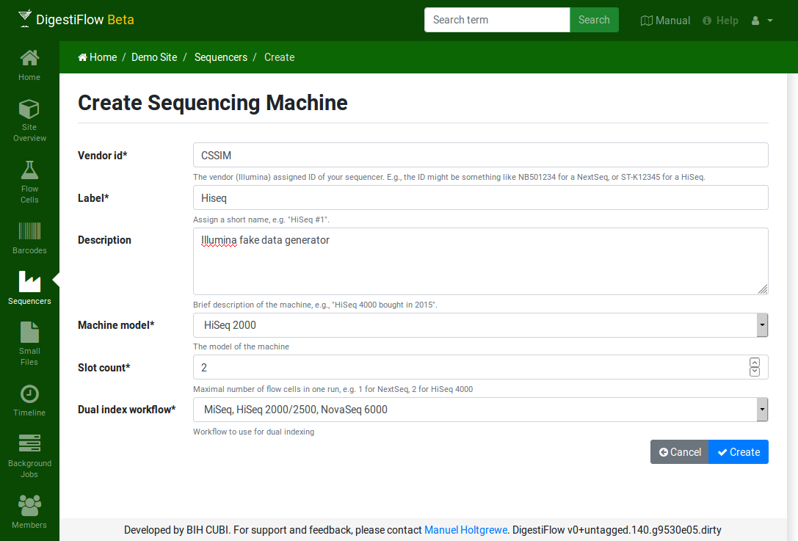
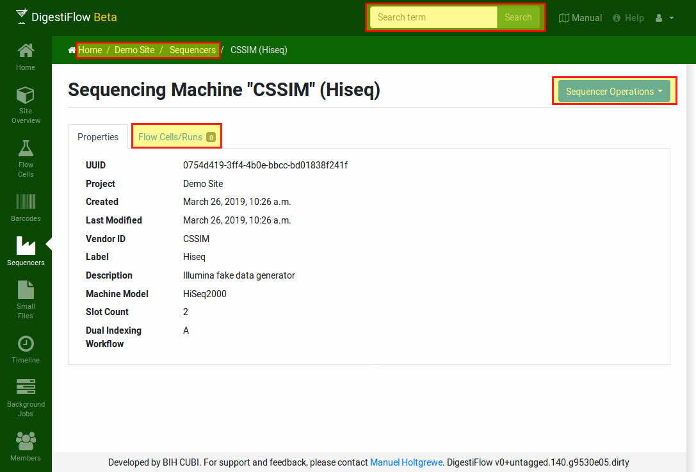
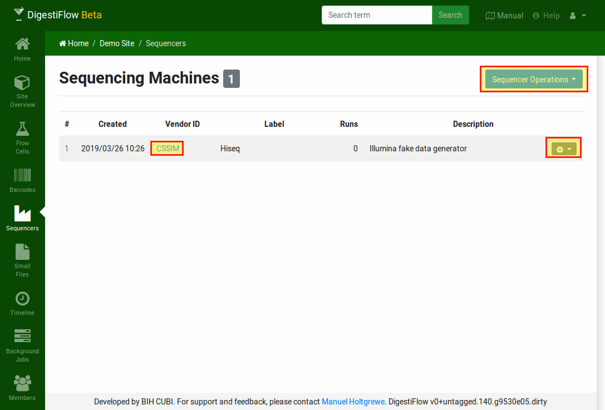

.. _first_steps_sequencers:

==============================
Tutorial: Configure Sequencers
==============================

First, you have to register the sequencers of your lab with Digestiflow.
For this, click the "Sequencers" section in the left-hand green icon bar.
You will are then redirect to a site listing all of your sequencers.

Click the blue button "Sequencer Operations" button on the top right and then "Create".
It is important to configure the machine model and the "Dual index workflow" appropriately such that demultiplexing works correctly with dual indexing.
Fill the form and click the "Create" button on the bottom right to create it.

If you want to follow the tutorial and add a flowcell with simulated data, you can now add a sequencer of model Hiseq 2000 called "CSSIM".

    The form for creating a sequencing machine.

After creating the sequencer you are redirected to the detail view of the sequencer.

    The detailed view of the sequencer.

The "Properties" tag shows the details of the sequencer.
For example, the sequencer reecord that we just created has two "slots" and allows to sequence using two flow cells at the same time.
The "Flow Cells/Runs" tab displays all runs - at the moment no runs, a count of 0.
The blue button on the top right gives access to updating or deleting the flow cell record, or exporting it to JSON.

Note that using the "breadcrumb" bar on the top allows for navigating back to the sequencer list or even the site overview.
Also note that you could now already use the search function in the top bar and, e.g., entering "cssim" (or even "css") would find your sequencer.
Next, use the breadcrumb bar to navigate back to the list of sequencers.

    The sequencer list view.

In the list of sequencers, you can click the sequencer ID to see the sequencer details.
The table of sequencers has a small gray button with a cog icon.
Click it to see the actions for the sequencer (e.g., delete or update).

Read on how to add a barcode set and create a flow cell.
