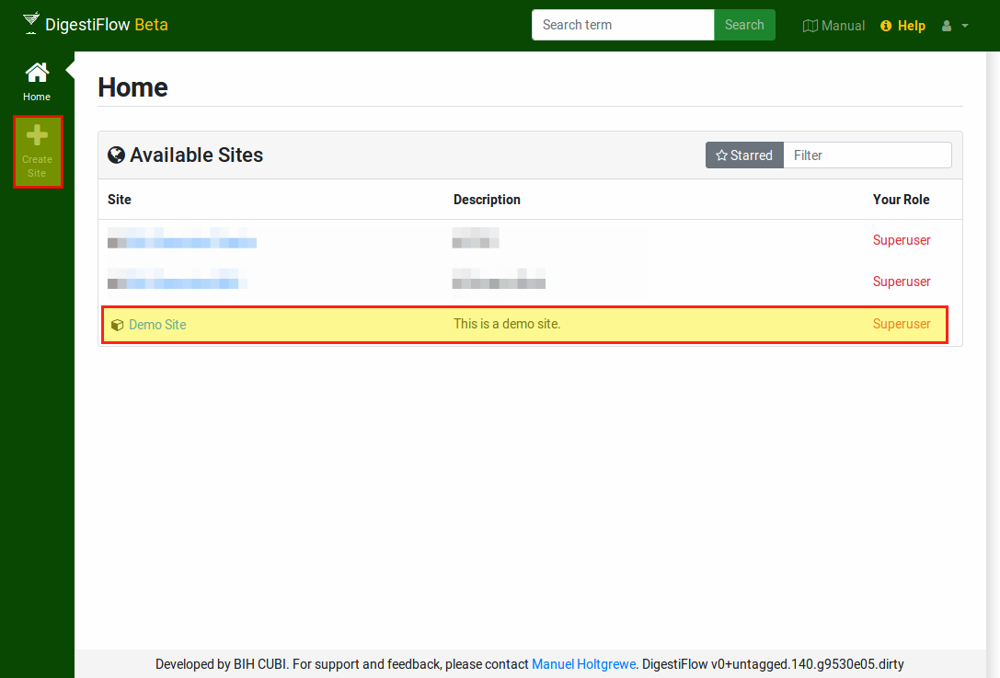

.. _first_steps_sites:

=====================
Tutorial: Setup Sites
=====================

Digestiflow can support more than one sequencing lab per installation by managing a set of **sites**.
After logging into Digestiflow with the super user that you created in the installation step, you first have to setup a first site by clicking on "Create Site" in the left green action bar.
If your window is not wide enough, that link might be hiding in a dark-gray symbol with three stripes.
It might be a good idea to zoom out a bit in your browser window so you see the green action bar on the left-hand side.

    The site list as displayed when logged in as a super user.
    The "Create Site" icon on the left-hand bar allows the creation of new sites.

Fill out the "Create Site" form's Title and Description field, you can leave the remaining ones at their default settings.
After creating the site, you will navigate to it and you will see its overview page.
The main part on the right will give the title, a short description/README, the latest five flow cells, the latest five added barcode sets, sequencing machines.
Further, as an admin of the site, you will see the latest five small files (created from message attachments), and the latest fives timeline entries.

Read on to learn about setting up sequencers and barcode sets.
