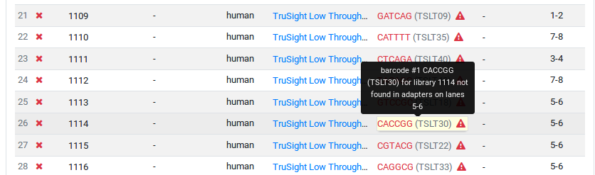
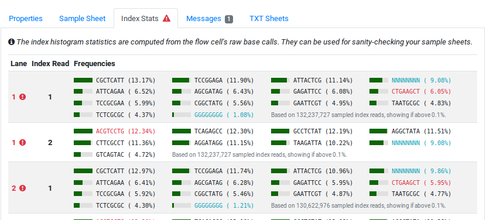

.. _flowcells_details:

===============
Flow Cell Views
===============

Differently from the rest of the manual, we will first describe the flow cell details view as this simplifies the explanation.

-----------------
Flow Cell Details
-----------------

The detail view shows the following information for each flow cell.
This view also highlights errors that were detected in the sample sheet or inconsistencies between the sample sheet and the raw BCL calls.

Note that the messages tab is documented in detail in :ref:`flowcells_messages`.

Properties Tab
==============

This tab shows the detailed information about the flow cells.

UUID
    The internal identifier used for the flow cell.

Site
    The name of the containing site.

Created
    Time of creation.

Last Modified
    Time of last modification.

Full Name
    Full folder name.

Sequencer
    The sequencer that this flow cell was run on.
    Links to the details view of the sequencer.

Manual Label
    Manual label override, if any.

Number of Lanes
    Number of lanes on the flow cell

Operator
    Name of the sequencing operator that was entered.

RTA Version
    The RTA version used for producing the flow cell.

Status Sequencing
    The status of the sequencing process.

Status Conversion
    The status of the base calling/base call archival process.

Status Deliver
    The status of the delivery process.

Delivery Type
    Delivery of sequences or raw base call archive.

Planned Reads
    Cycle configuration programmed into the sequencer.

Current Reads
    Currently processed reads.

Manual Demux Reads
    A manual override for the cycle information to use for demultiplexing.

Sheet Completeness
    Whether the sheet is completely filled.

All BCL indexes in sheet?
    Information about missing indices in sheet that were found in the BCL files.

All sheet libraries in BCL?
    Information about missing indices in bcl that were present in the sheet.

Sample Sheet
============

    Example of an error detected in the sample sheets.
    Some indices appear to be missing in the BCL data.

A list of the sample sheet with status indicators.
Problems are indicated as yellow and red icons in the sample sheet.
You can click on these icons to acknowledge the problem and silence it.

.. info:

    The authors consider it best practice to fix the sample sheet where possible instead of silencing problems.
    In any case, an explanation of the issues should be added to the flow cell comments and/or messages should be left.

Base Call Information
=====================

This panel shows the index barcode statistics.
For each lane and index read, this panel shows the distribution of barcode histograms.
Erorrs and artifacts are highlighted.
This view can be used for root cause error analysis of problems with demultiplexing.

    Example of error display in the "Index Stats" tab.

In the example, libraries with barcodes CTGAAGCT, ACGTCCTG, and CTGAAGCT were found in the BCL data but were not present in the sample sheet.
The sequence NNNNNNNN and GGGGGGGG were also found in the BCL data and not in the sample sheet.
However, these are known artifacts and thus not marked as errors.

--------------
Flow Cell List
--------------

The flow cell list shows a list of all flow cells registered with the system.
The information in each row is relatively dense to allow to get the most relevant information with a single glance and at the same time allow for easily updating the state for flow cells with very few clicks.

The columns are as follows:

Information / Notification
    In the case of any warning or error a yellow or red icon will be displayed here.

Observation Indicator
    This column indicates whether you are watching the flow cell and will receive emails on changes.

Sequencing Status, Demultiplexing Status, Delivery Status
    The first three columns display little icons for the three different states.

Deliver Sequence Conversion and/or Archives with Base Calls
    The next two icons indicate whether sequence conversion is asked and/or archives with the raw base calls are to be generated.

Comment / Message / Attachments Indicator
    Whether or not the comment field of the flow cell is filled, messages have been added to the flow cell and/or there are attachments with the messages.

Barcode Statistics Indicator
    Whether or not barcode statistics are available for the flow cell.

Date
    Sequencing date from the flow cell.

Instrument / Sequencing Machine
    The name of the sequencing machine.
    Clicking on the name leads to the detail view of the given sequencer.

Run Number
    The sequential number of runs on the given machine.

Flow Cell Vendor ID
    The vendor ID of the flow cell, label and potentially the manual label override

Mode
    The cycle configuration for the flow cell.

Seq./Demux. Operator
    Names of the demultiplexing operator.

Libraries
    Number of libraries in the sample sheet for the flow cell.

The little gray button on the right-hand side of the table rows allows to access the functions for updating and deleting flow cells.

---------------
Updating Status
---------------

When clicking the status icons, a window with a list of button appears.
You can use this for changing the individual state of the flow cell with two clicks.
After selecting the target state, the state will be updated and the row will be updated to reflect the results.
