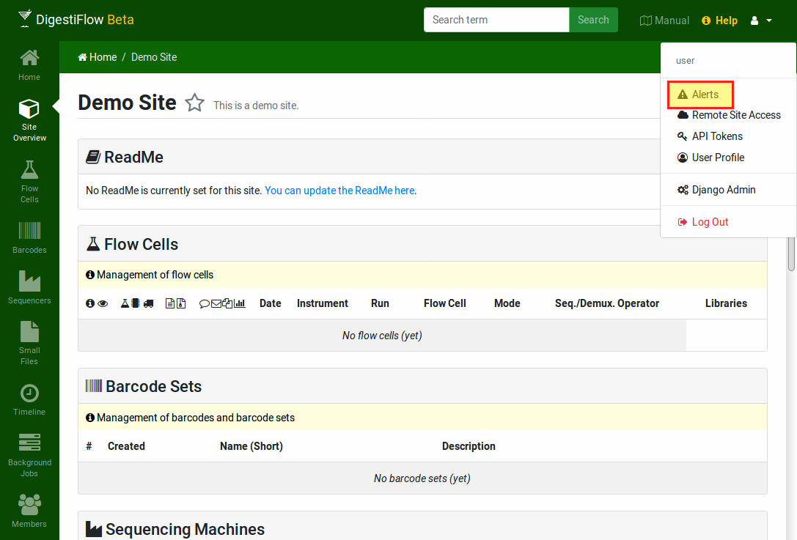

.. _misc_admin_alerts:

============
Admin Alerts
============

Users with superuser status have access to the entry "Alerts" in the user menu on th etop right hand side of the screen.
This feature can be used for displaying messages that are visible to everyone (also publically on the login page).
Common uses are for announcing maintenance times etc.

    The user menu displays the "Alert" entry for superusers.
    Use this link to access the the Admin Alerts administration section.
